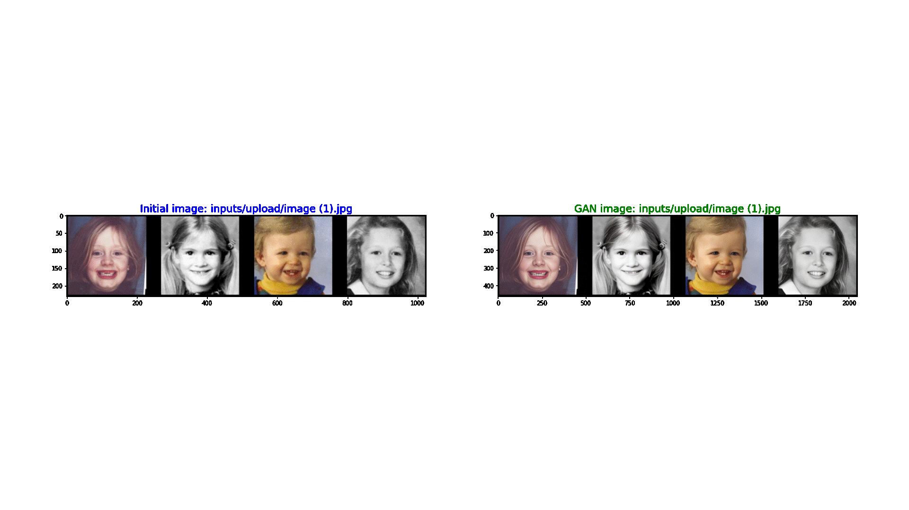

# GFPGAN

GFPGAN is a blind face restoration algorithm towards real-world face images.   
It leverages the generative face prior in a pre-trained GAN (*e.g.*, StyleGAN2) to restore realistic faces while precerving fidelity.  

https://github.com/TencentARC/GFPGAN
